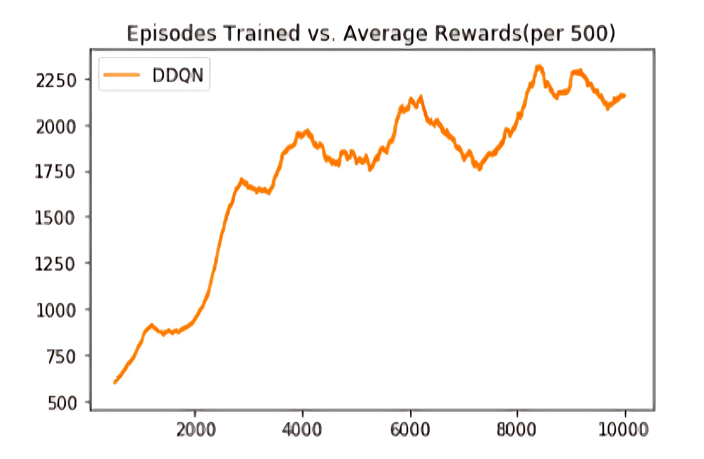

# Mario‑RL Agent 🕹️🐢 — Playing **Super Mario Bros.** with Double DQN

A research‑grade reinforcement‑learning agent that learns to clear *Super Mario Bros.* levels using a **Double Deep Q‑Network (DDQN)**.  
The project began as my final project for *ITCS 5156 – Applied Machine Learning* at UNC Charlotte and explores how careful state abstraction, frame preprocessing, and target‑network stabilisation make deep RL tractable for classic platformers.

---

## Demo

| Type | Link |
|------|------|
| 🔎 **Notebook** | [`MARIO_RL.ipynb`](./MARIO_RL.ipynb) |

---

## Table of Contents
1. [Features](#features)
2. [Quick Start](#quick-start)
3. [Project Structure](#project-structure)
4. [Methodology](#methodology)
   - [Environment Wrappers](#environment-wrappers)
   - [Network Architecture](#network-architecture)
   - [Training Regimen](#training-regimen)
5. [Results](#results)
6. [Future Work](#future-work)
7. [Contributing](#contributing)
8. [License](#license)
9. [Acknowledgements](#acknowledgements)

---

## Features
- **Double DQN training loop** with separate *online* and *target* networks for stable Q‑updates.  
- **Frame‑stacked, grayscale, down‑sampled state** (`4 × 84 × 84`) for sample‑efficient learning.  
- **Custom Gym wrappers** (`SkipFrame`, `GrayScaleObservation`, `ResizeObservation`, `FrameStack`) to shrink the observation space and skip redundant frames.  
- Replay buffer with *uniform random sampling* and an *epsilon‑greedy* exploration schedule.  
- Fully self‑contained **Jupyter notebook**—run, visualise, and tweak every component in one place.  
- Plug‑and‑play for other **NES Gym** environments; only the action mapping changes.

---

## Quick Start

### 1. Clone & create env (🐍 Python 3.9+)

```bash
git clone https://github.com/<your‑handle>/mario‑rl.git
cd mario‑rl
python -m venv .venv && source .venv/bin/activate
pip install -r requirements.txt
```

<details>
<summary><code>requirements.txt</code></summary>

```
gym-super-mario-bros==7.4.0
nes-py==8.2.1
torch>=2.2
torchvision
numpy
opencv-python
matplotlib
tqdm
```
</details>

### 2. Run the notebook

```bash
jupyter notebook MARIO_RL.ipynb
```

> **Tip 💡** Prefer a pure‑Python script? Export the notebook (`jupyter nbconvert --to script`) or adapt the cells into `train.py`.

---

## Project Structure

```
mario‑rl/
│
├── MARIO_RL.ipynb        # end‑to‑end notebook (data‑prep → training → eval)
   └── agents/
   │   └── ddqn.py           # DDQN implementation (actor, optimiser, buffer)
   └── wrappers/
   │   └── mario_wrappers.py # SkipFrame, GrayScaleObservation, ResizeObservation, ...
   └── assets/
   │   ├── reward_curve.png  # training curves
   │   └── demo.gif          # short gameplay GIF
   └── requirements          # in the beginning
└── README.md
```

Feel free to reorganise—paths inside the notebook use relative imports.

---

## Methodology

### Environment Wrappers
| Wrapper | Purpose | Output Shape |
|---------|---------|--------------|
| `GrayScaleObservation` | Drop RGB channels → memory & compute ↓ | `1 × 240 × 256` |
| `ResizeObservation` | Down‑sample to square frame | `1 × 84 × 84` |
| `SkipFrame(n=4)` | Return every *n*‑th frame, accumulate rewards | — |
| `FrameStack(k=4)` | Stack *k* past frames → motion awareness | `4 × 84 × 84` |

Together these wrappers condense the raw NES screen into a manageable **28 kB** tensor while preserving temporal dynamics.

### Network Architecture
```
Input: 4 × 84 × 84
│
├─ CNN(32 @ 8×8, stride 4) → ReLU
├─ CNN(64 @ 4×4, stride 2) → ReLU
├─ CNN(64 @ 3×3, stride 1) → ReLU
│            └──► flatten → FC(512) → ReLU
└─ FC(|A|)  # |A| = number of discrete actions
```
The *target* network weights are hard‑copied from the *online* network every **1 000** steps to mitigate value blow‑up.

### Training Regimen
| Hyper‑parameter | Value |
|-----------------|-------|
| Episodes | 40 000 |
| Replay Capacity | 100 000 |
| Minibatch Size | 32 |
| Optimiser | Adam (lr = 1e‑4) |
| Discount γ | 0.99 |
| Exploration ϵ | 1.0 → 0.05 (linear decay over 1 M steps) |

Average return plateaus after ~10 k episodes; level‑completion rate peaks closer to 40 k.

---

## Results



- **Convergence**: returns stabilise rapidly; extra training chiefly improves *survival time*.  
- **Sample efficiency**: DDQN needs orders‑of‑magnitude fewer frames than vanilla DQN on identical hardware.  
- **Limitations**: only two discrete actions were trained (RIGHT, JUMP) due to compute constraints—power‑ups and backward movement are ignored.

---

## Future Work
- Expand action space (LEFT, FIRE, SPEED) and train across multiple level seeds.  
- Reward shaping for coin collection / enemy stomps to create *aggressive* or *treasure‑hunter* behaviours.  
- **Prioritised replay** or **Rainbow DQN** improvements for better sample efficiency.  
- Port to **Gymnasium** and ☕ **Java Mario AI Benchmark** for cross‑environment benchmarking.

---

## Contributing

Bug reports and pull requests are welcome! Please open an issue describing:

1. What went wrong or what feature you propose  
2. Steps to reproduce / design sketch  
3. Environment (Python version, CUDA, etc.)

Then fork → feature branch → PR.

---

## License

This project is released under the **MIT License**—see [`LICENSE`](./LICENSE) for details.

---

## Acknowledgements
- H. van Hasselt, A. Guez, D. Silver — *Deep RL with Double Q‑Learning* (AAAI 2016)  
- OpenAI Gym & `gym‑super‑mario‑bros` community  
- UNC Charlotte ITCS 5156 course & Dr. Lee for project guidance  

*Made with ❤️ and far too many Goombas.*
